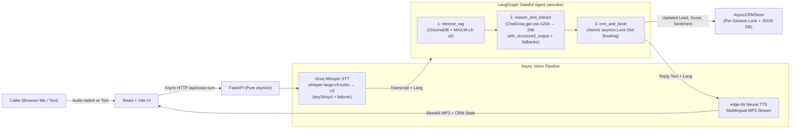
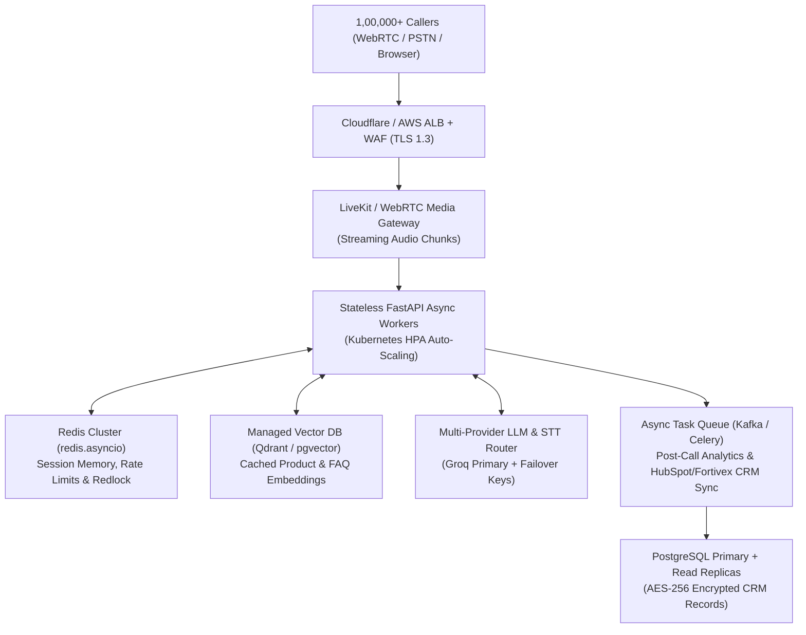

# System Architecture — Fortivex AI Autonomous Sales Voice Agent

## End-to-End Request & Agentic Flow (Current MVP)

```mermaid
flowchart LR
    U["Caller (Browser Mic / Text)"] -->|Audio webm or Text| FE["React + Vite UI"]
    FE -->|Async HTTP /api/voice-turn| API["FastAPI (Pure asyncio)"]

    subgraph Voice["Async Voice Pipeline"]
        STT["Groq Whisper STT<br/>whisper-large-v3-turbo → v3<br/>(key3/key4 + failover)"]
        TTS["edge-tts Neural TTS<br/>Multilingual MP3 Stream"]
    end

    API --> STT
    STT -->|Transcript + Lang| LG

    subgraph LG["LangGraph Stateful Agent (ainvoke)"]
        N1["1. retrieve_rag<br/>(ChromaDB + MiniLM-L6-v2)"]
        N2["2. reason_and_extract<br/>(ChatGroq gpt-oss-120b → 20b<br/>with_structured_output + fallbacks)"]
        N3["3. crm_and_book<br/>(Atomic asyncio.Lock Slot Booking)"]
        N1 --> N2 --> N3
    end

    N3 -->|Updated Lead, Score, Sentiment| STORE["AsyncCRMStore<br/>(Per-Session Lock + JSON DB)"]
    N3 -->|Reply Text + Lang| TTS
    TTS -->|Base64 MP3 + CRM State| FE
```

---

## Production Scalability Architecture (1,00,000+ Concurrent Users)

```mermaid
flowchart TB
    Users["1,00,000+ Callers (WebRTC / PSTN / Browser)"] --> Edge["Cloudflare / AWS ALB + WAF (TLS 1.3)"]
    Edge --> LiveKit["LiveKit / WebRTC Media Gateway<br/>(Streaming Audio Chunks)"]
    LiveKit --> Workers["Stateless FastAPI Async Workers<br/>(Kubernetes HPA Auto-Scaling)"]

    Workers <--> Redis["Redis Cluster (redis.asyncio)<br/>Session Memory, Rate Limits & Redlock"]
    Workers <--> Vector["Managed Vector DB (Qdrant / pgvector)<br/>Cached Product & FAQ Embeddings"]
    Workers <--> LLM["Multi-Provider LLM & STT Router<br/>(Groq Primary + Failover Keys)"]
    Workers --> Queue["Async Task Queue (Kafka / Celery)<br/>Post-Call Analytics & HubSpot/Fortivex CRM Sync"]
    Queue --> PG["PostgreSQL Primary + Read Replicas<br/>(AES-256 Encrypted CRM Records)"]
```

